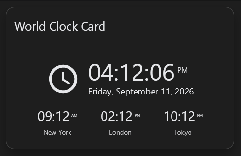
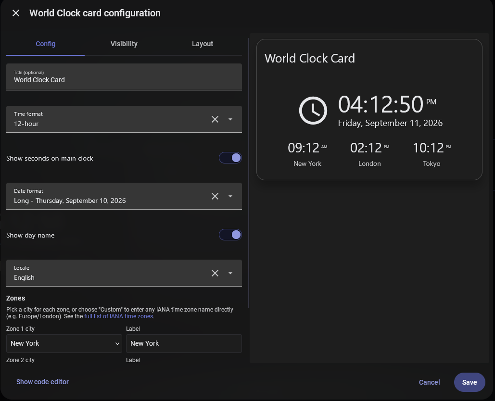

[](https://github.com/Serios/world-clock-card/releases)

# World Clock Card

A Home Assistant Lovelace card that shows the current local time and date,
plus the current time in three other timezones of your choice.



## Features

- Local time (12h/24h) and date, with configurable date format and optional
  weekday name
- Three configurable timezone clocks, each pickable from a list of cities or any custom IANA timezone
- Fully configurable through the Lovelace visual editor or plain YAML
- Responsive layout that adapts down to narrow card widths

## Installation

### HACS (recommended)

1. In Home Assistant, go to **HACS → Dashboard**.
2. Search for "World Clock Card".
3. Click it, then **Download**.
4. Add the card to a dashboard — HACS registers the resource for you
   automatically.

### Manual

1. Download `world-clock-card.js` from the
   [latest release](../../releases/latest) (or `dist/world-clock-card.js`
   from this repo).
2. Copy it into `<config>/www/`.
3. In Home Assistant, go to **Settings → Dashboards → Resources** and add:
   - URL: `/local/world-clock-card.js`
   - Resource type: **JavaScript module**

## Usage

Add the card via the dashboard's visual editor ("World Clock Card" will
appear in the card picker), or in YAML:

```yaml
type: custom:world-clock-card
title: My Clocks              # optional, omitted = no title row
time_format: auto             # auto | 12h | 24h
show_seconds: true            # true | false (default: true)
date_format: long             # long | medium | short | extra_short | numeric | iso
show_weekday: true            # true | false (default: true) — ignored for iso
locale: auto                  # auto | any language code Home Assistant supports
zones:
  - timezone: America/New_York
    name: New York
  - timezone: Europe/London
    name: London
  - timezone: Asia/Tokyo
    name: Tokyo
```



### Configuration options

| Option         | Type    | Default  | Description                                                                 |
| -------------- | ------- | -------- | ----------------------------------------------------------------------------|
| `title`        | string  | none     | Optional card title. Omit for no title row.                                 |
| `time_format`  | string  | `auto`   | `auto` (follow your Home Assistant setting), `12h`, or `24h`.                |
| `show_seconds` | boolean | `true`   | Show seconds on the main clock.                                             |
| `date_format`  | string  | `long`   | `long`, `medium`, `short`, `extra_short`, `numeric`, or `iso`.               |
| `show_weekday` | boolean | `true`   | Show the day name. Has no effect when `date_format` is `iso`.               |
| `locale`       | string  | `auto`   | `auto`, or any language code Home Assistant has translations for, e.g. `en`, `bg`, `de`, `fr`, `es`, `ru`, `it`, `pl`, `tr`, etc. |
| `zones`        | list    | required | Exactly 3 entries, each with a `timezone` (IANA name) and a `name` (label). |

The full list of valid IANA timezone names is on
[Wikipedia](https://en.wikipedia.org/wiki/List_of_tz_database_time_zones).

## Development

```bash
npm install
npm run build       # bundled + minified -> dist/world-clock-card.js
npm run build:dev   # unminified with sourcemap, for debugging
```

Edit `src/world-clock-card.js`; never edit `dist/world-clock-card.js`
directly — it's generated.

## License

MIT
